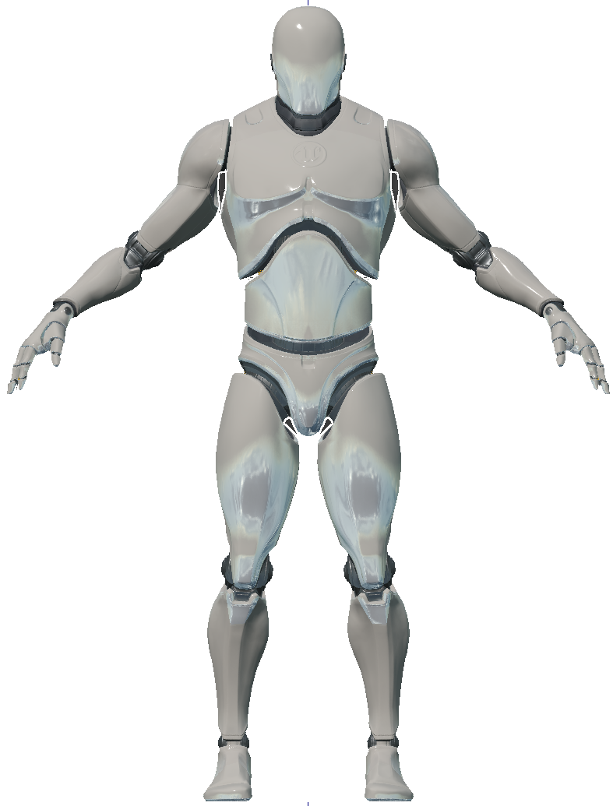
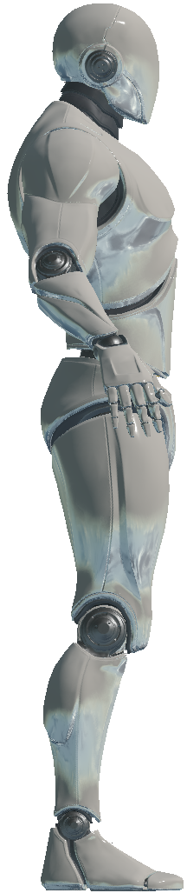

.. _`android-agent`:

AndroidAgent
=============

Images
------

Description
-----------
An android agent that can be controlled via torques supplied to its joints.
See :class:`~holodeck.agents.AndroidAgent` for more details.

.. _`android-joints`:

Android Joints
--------------
The control scheme for the android and the
:class:`~holodeck.sensors.JointRotationSensor` use a 94 length vector refer 
to 48 joints. 

To gain insight into these joints, refer to the table below, or use the 
:meth:`~holodeck.agents.AndroidAgent.joint_ind` helper method to convert a
name (eg ``spine_02``) to and index (``6``).

.. note::
    Note that the index given is the start index for the joint, see the section
    header for how many values after this index each joint has.

    Example: ``neck_01`` starts at index 3, and has ``[swing1, swing2, twist]``, so index
    3 in the 94 length vector corresponds to ``swing1``, 4 corresponds to ``swing2``, and
    5 corresponds to ``twist`` for ``neck_01``

Returned in the following order:

+-------------------------------------+-----------------------+
| **Head, Spine, and Arm joints**                             |
|                                                             |
| Each has ``[swing1, swing2, twist]``                        |
+-------------------------------------+-----------------------+
| ``0``                               | ``head``              |
+-------------------------------------+-----------------------+
| ``3``                               | ``neck_01``           |
+-------------------------------------+-----------------------+
| ``6``                               | ``spine_02``          |
+-------------------------------------+-----------------------+
| ``9``                               | ``spine_01``          |
+-------------------------------------+-----------------------+
| ``12``                              | ``upperarm_l``        |
+-------------------------------------+-----------------------+
| ``15``                              | ``lowerarm_l``        |
+-------------------------------------+-----------------------+
| ``18``                              | ``hand_l``            |
+-------------------------------------+-----------------------+
| ``21``                              | ``upperarm_r``        |
+-------------------------------------+-----------------------+
| ``24``                              | ``lowerarm_r``        |
+-------------------------------------+-----------------------+
| ``27``                              | ``hand_r``            |
+-------------------------------------+-----------------------+
| **Leg Joints**                                              |
|                                                             |
| Each has ``[swing1, swing2, twist]``                        |
+-------------------------------------+-----------------------+
| ``30``                              | ``thigh_l``           |
+-------------------------------------+-----------------------+
| ``33``                              | ``calf_l``            |
+-------------------------------------+-----------------------+
| ``36``                              | ``foot_l``            |
+-------------------------------------+-----------------------+
| ``39``                              | ``ball_l``            |
+-------------------------------------+-----------------------+
| ``42``                              | ``thigh_r``           |
+-------------------------------------+-----------------------+
| ``45``                              | ``calf_r``            |
+-------------------------------------+-----------------------+
| ``48``                              | ``foot_r``            |
+-------------------------------------+-----------------------+
| ``51``                              | ``ball_r``            |
+-------------------------------------+-----------------------+
| **First joint of each finger**                              |
|                                                             |
| Has only ``[swing1, swing2]``                               |
+-------------------------------------+-----------------------+
| ``54``                              | ``thumb_01_l``        |
+-------------------------------------+-----------------------+
| ``56``                              | ``index_01_l``        |
+-------------------------------------+-----------------------+
| ``58``                              | ``middle_01_l``       |
+-------------------------------------+-----------------------+
| ``60``                              | ``ring_01_l``         |
+-------------------------------------+-----------------------+
| ``62``                              | ``pinky_01_l``        |
+-------------------------------------+-----------------------+
| ``64``                              | ``thumb_01_r``        |
+-------------------------------------+-----------------------+
| ``66``                              | ``index_01_r``        |
+-------------------------------------+-----------------------+
| ``68``                              | ``middle_01_r``       |
+-------------------------------------+-----------------------+
| ``70``                              | ``ring_01_r``         |
+-------------------------------------+-----------------------+
| ``72``                              | ``pinky_01_r``        |
+-------------------------------------+-----------------------+
| **Second joint of each finger**                             |
|                                                             |
| Has only ``[swing1]``                                       |
+-------------------------------------+-----------------------+
| ``74``                              | ``thumb_02_l``        |
+-------------------------------------+-----------------------+
| ``75``                              | ``index_02_l``        |
+-------------------------------------+-----------------------+
| ``76``                              | ``middle_02_l``       |
+-------------------------------------+-----------------------+
| ``77``                              | ``ring_02_l``         |
+-------------------------------------+-----------------------+
| ``78``                              | ``pinky_02_l``        |
+-------------------------------------+-----------------------+
| ``79``                              | ``thumb_02_r``        |
+-------------------------------------+-----------------------+
| ``80``                              | ``index_02_r``        |
+-------------------------------------+-----------------------+
| ``81``                              | ``middle_02_r``       |
+-------------------------------------+-----------------------+
| ``82``                              | ``ring_02_r``         |
+-------------------------------------+-----------------------+
| ``83``                              | ``pinky_02_r``        |
+-------------------------------------+-----------------------+
| **Third joint of each finger**                              |
|                                                             |
| Has only ``[swing1]``                                       |
+-------------------------------------+-----------------------+
| ``84``                              | ``thumb_03_l``        |
+-------------------------------------+-----------------------+
| ``85``                              | ``index_03_l``        |
+-------------------------------------+-----------------------+
| ``86``                              | ``middle_03_l``       |
+-------------------------------------+-----------------------+
| ``87``                              | ``ring_03_l``         |
+-------------------------------------+-----------------------+
| ``88``                              | ``pinky_03_l``        |
+-------------------------------------+-----------------------+
| ``89``                              | ``thumb_03_r``        |
+-------------------------------------+-----------------------+
| ``90``                              | ``index_03_r``        |
+-------------------------------------+-----------------------+
| ``91``                              | ``middle_03_r``       |
+-------------------------------------+-----------------------+
| ``92``                              | ``ring_03_r``         |
+-------------------------------------+-----------------------+
| ``93``                              | ``pinky_03_r``        |
+-------------------------------------+-----------------------+

Control Schemes
---------------

- Android Torques

See :class:`~holodeck.agents.AndroidAgent` for details on how this control scheme works.

.. TODO: Example code

Sockets
---------------

- ``CameraSocket`` located in the middle of the android's face
- ``Viewport`` located behind the agent
- All of the joints may be used as sockets. See 
  :ref:`android-joints`
