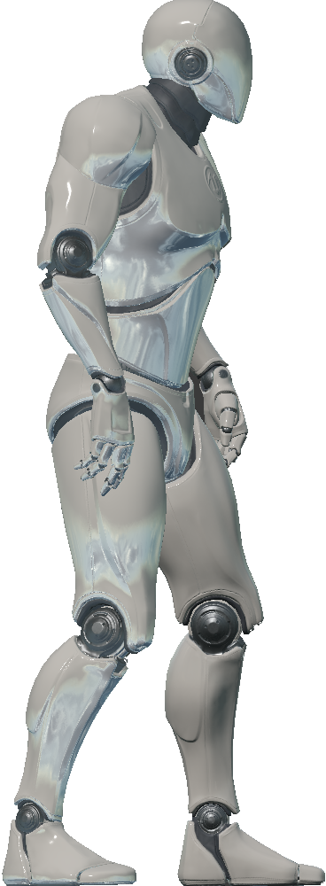

.. _`nav-agent`:

NavAgent
========

Images
------

See :class:`holodeck.agents.NavAgent` for more details.

Description
-----------
The NavAgent is not meant for training, it is meant to be used as an objective
in tasks. Given world coordinates, it will use use Unreal's AI system to 
attempt to intelligently navigate towards those coordinates.

Control Schemes
---------------
**Nav Target Location (``0``)**
 A 3-length floating point vector used to specify the x, y and z
 coordinates for the agent to navigate to.

Sockets
-------

None.
