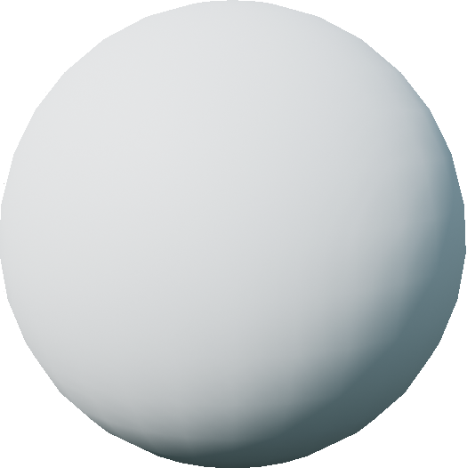

.. _`sphere-agent`:

SphereAgent
===========

Images
------

Description
-----------

A basic sphere robot that moves along a plane. The SphereAgent does not have 
physics - it simply computes its next location and teleports there, as 
compared to the :ref:`turtle-agent` which has mass and momentum.

See :class:`~holodeck.agents.SphereAgent` for more details.

Control Schemes
---------------

**Sphere discrete** (``0``)
  A single-length integer vector that accepts 1 of four
  possible numbers; 0: move forward, 1: move backward, 
  2: turn right, 3: turn left

**Sphere continuous** (``1``)
  A 2-length floating point vector used to specify 
  the agent's forward speed (index 0) and rotation speed (index 1).

Sockets
---------------

- ``CameraSocket`` located at the front of the sphere body
- ``Viewport`` located behind the agent

.. image:: images/sphere-sockets.png
   :scale: 30%
