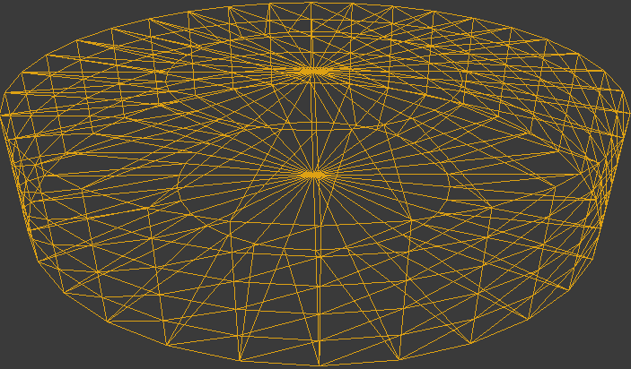

.. _`turtle-agent`:

TurtleAgent
===========

Description
-----------
A simple turtle-bot agent with an arrow pointing forwards. Its radius is 
approximately 25cm and is approximately 10cm high.

The TurtleAgent moves when forces are applied to it - so it has momentum and
mass, compared to the :ref:`sphere-agent` which teleports around. The 
TurtleAgent is subject to gravity and can climb ramps and slopes.

See :class:`~holodeck.agents.TurtleAgent` for more details.

Control Schemes
---------------

**Sphere continuous** (``1``)
  A 2-length floating point vector used to specify
  the agent's forward force (index 0) and rotation force (index 1).

Sockets
-------

- ``CameraSocket`` located at the front of the body
- ``Viewport`` located behind the agent

.. image:: images/turtle-sockets.png
   :scale: 30%
