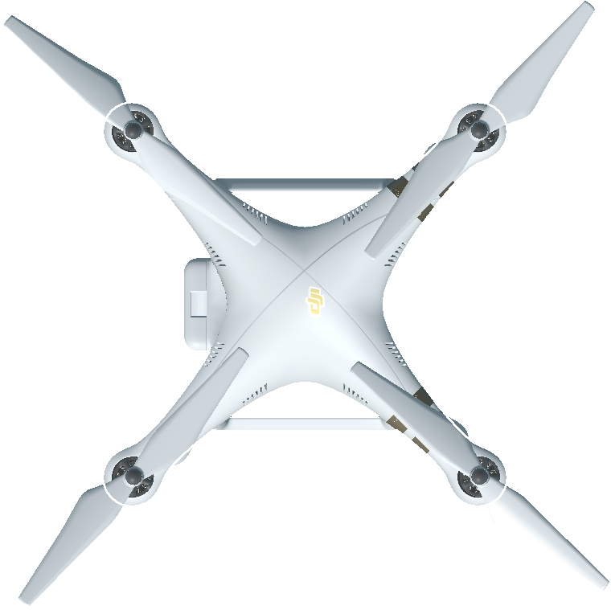
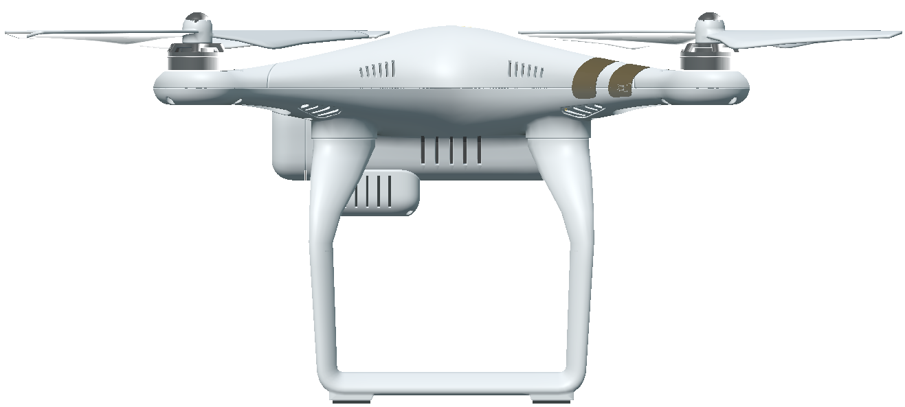

.. _`uav-agent`:

UavAgent
========

Images
------

.. image:: images/uav-perspective.png
   :scale: 20%

Description
-----------
A quadcopter UAV agent. 

See the :class:`~holodeck.agents.UavAgent` class. 

Control Schemes
---------------

**UAV Torques (``0``)**
  A 4-length floating point vector used to specify the pitch torque,
  roll torque, yaw torque and thrust with indices 0, 1, 2 and 3 respectively.

**UAV Roll / Pitch / Yaw targets(``1``)**
  A 4-length floating point vector used to specify the pitch,
  roll, yaw, and altitude targets. The values are specified in
  indices 0, 1, 2, and 3 respectively.

Sockets
-------

- ``CameraSocket`` located underneath the uav body
- ``Viewport`` located behind the agent

.. image:: images/uav-sockets.png
   :scale: 30%
