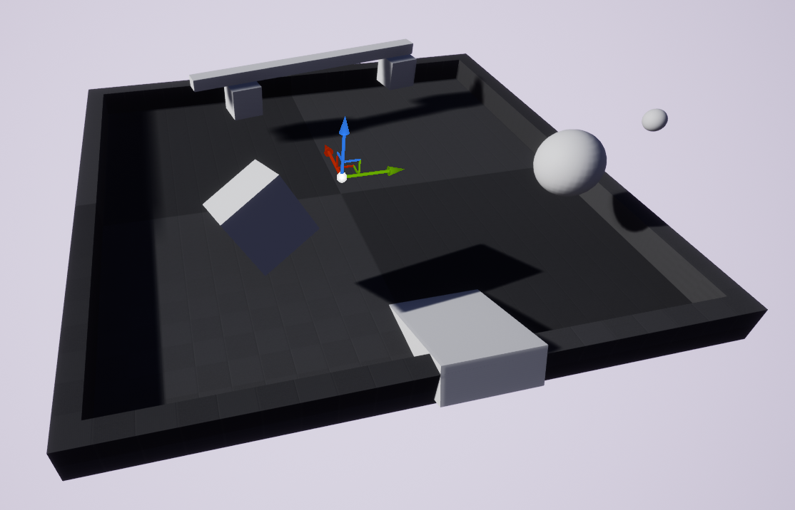
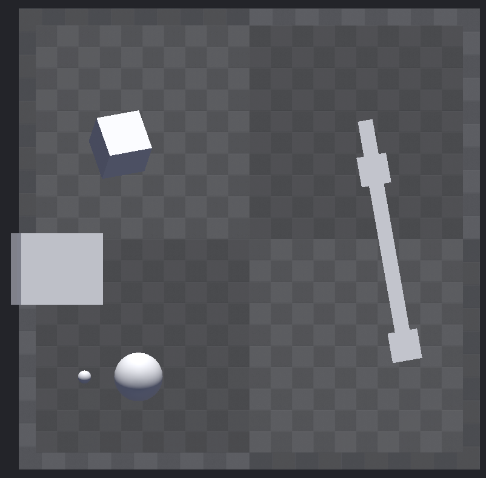

AndroidPlayground
=================

This is a small world with some props agents can interact with. It was designed
for the android to interact with.

Layout
------

Tagged Items
------------

- ``cube``
- ``small-ball``
- ``big-ball``
- ``small-box1``
- ``small-box2``
- ``large-box``

.. toctree::
   :maxdepth: 1
   :caption: Scenarios
   :glob:

   AndroidPlayground-*