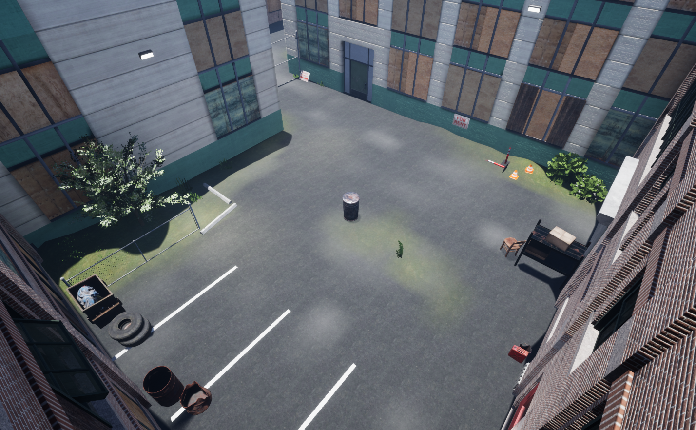

.. _`clean-up-world`:

Clean Up
========

This is an alleyway with a trash can in the middle. A :ref:`clean-up-task` 
task can be used to spawn trash around the can and give a reward based on the
amount of trash collected in the can.

Layout
------

.. image:: clean-up-top.png
   :scale: 50%

.. toctree::
   :maxdepth: 1
   :caption: Scenarios
   :glob:

   CleanUp-*
