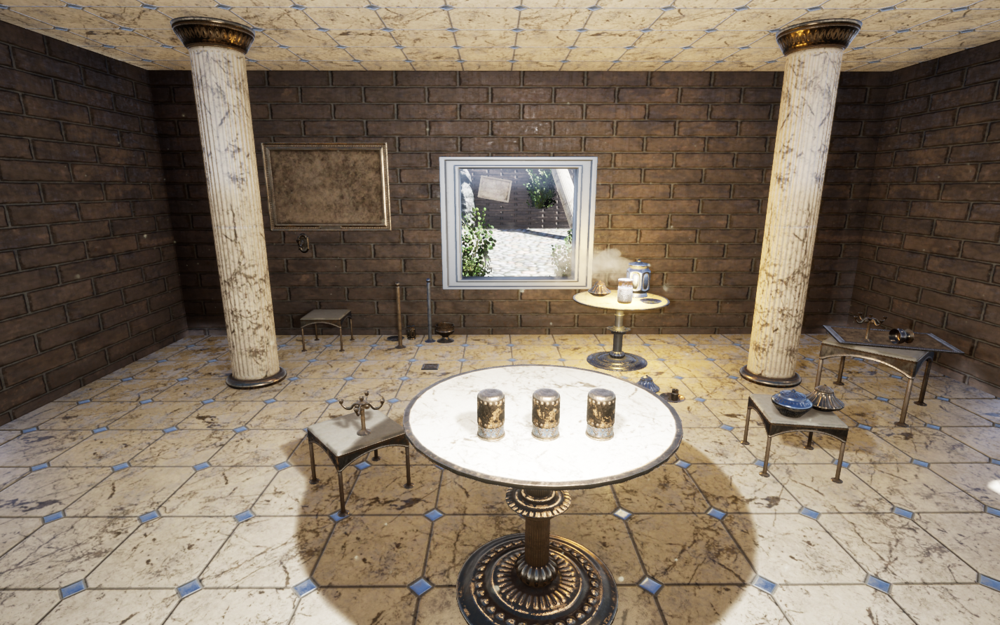
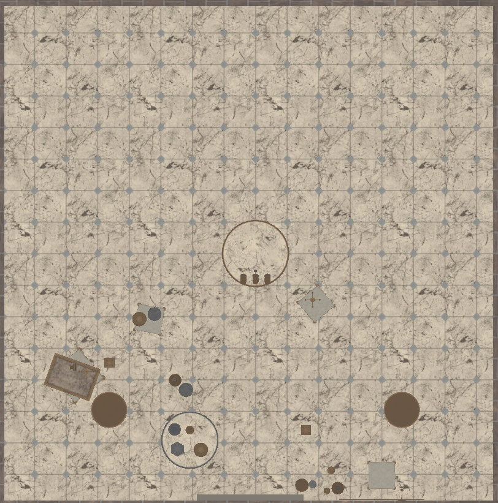

.. _`cup-game-world`:

CupGame
=======

This is a small room with a game of ball and cups sitting on a table. In order
to activate the game, an agent must have the CupGameTask added to it. 

If you want to reconfigure the task (change the number of shuffles, change
the speed, etc), call the :meth:`~holodeck.sensors.CupGameTask.start_game` 
method on the :class:`~holodeck.sensors.CupGameTask` class or alter the config
file (see the :ref:`configuration <cup-game-task-config>` of the 
:ref:`cup-game-task`.)

Layout
------

.. toctree::
   :maxdepth: 1
   :caption: Scenarios
   :glob:

   CupGame-*

