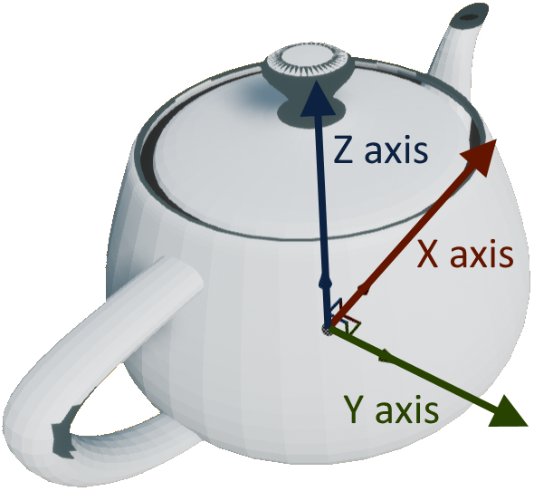

=================================
Units and Coordinates in Holodeck
=================================

Holodeck uses **meters** for units and a **left-handed coordinate system** for
all locations, distances, and offsets.

.. _`coordinate-system`:

Coordinate System
=================

Since Holodeck depends on Unreal Engine, we use a left handed coordinate system
with positive ``z`` being up.
This is something baked deep into the engine that we 
`can't easily change <https://twitter.com/timsweeneyepic/status/952661474501111808?lang=en>`_.

So, when you need to specify a location in Holodeck, the format is as follows

``[x, y, z]`` where:

- Positive ``x`` is **forward**
- Positive ``y`` is **right**
- Positive ``z`` is **up**

Remember that the units for ``[x, y, z]`` are in meters (Unreal Engine
defaults to centimeters, we've changed this to make things a bit easier).

.. _`rotations`:

Rotations
=========

Rotations are specified in ``[roll, pitch, yaw]`` / ``[x, y, z]`` format, in in degrees. This means

- **Roll**: Rotation around the forward (``x``) axis
- **Pitch**: Rotation around the right (``y``) axis
- **Yaw**: Rotation around the up (``z``) axis

(`source <https://api.unrealengine.com/INT/API/Runtime/Core/Math/FRotator/index.html>`_)