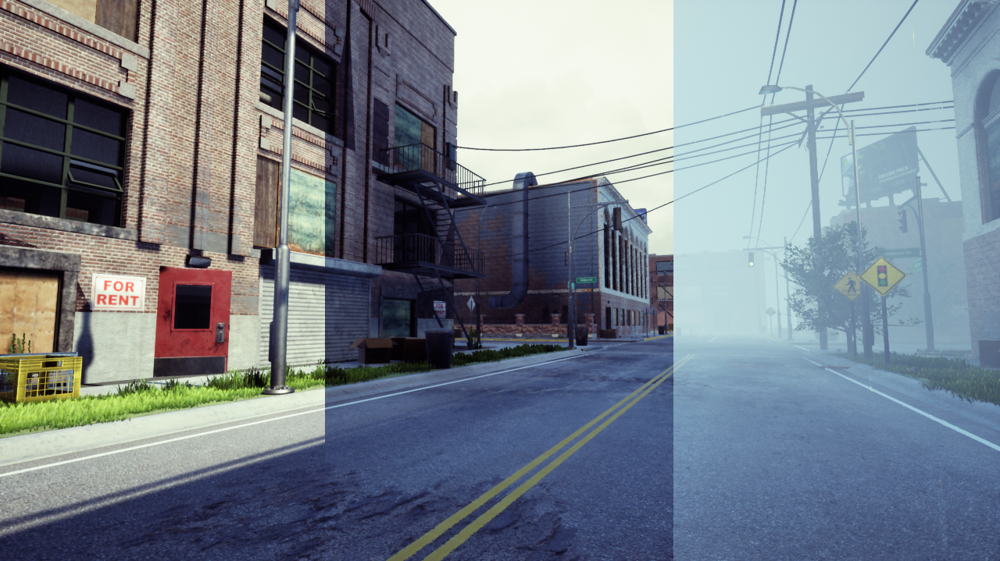

.. _`weather`:

Configuring Weather and Time
============================

Holodeck worlds have weather and time that can be configured, either with
:ref:`scenarios` or programmatically in real time.

See the :class:`~holodeck.weather.WeatherController` documentation for
reference.

Weather Options
~~~~~~~~~~~~~~~

Type
----

Holodeck worlds have three possible types of weather: ``sunny``
``cloudy`` and ``rain``.

In a scenario
^^^^^^^^^^^^^

.. code-block:: json

   {
      "weather": {
         "type": "rain"
      }
   }

Programmatically
^^^^^^^^^^^^^^^^

.. code-block:: python

   env = holodeck.make("...")
   env.weather.set_weather("rain")

Fog depth
---------

.. image:: fog_depth.gif
   :scale: 55%

Fog depth is set on scale from ``0`` to ``1``.

In a scenario
^^^^^^^^^^^^^

.. code-block:: json

   {
      "weather": {
         "fog_depth": 0.5
      }
   }

Programmatically
^^^^^^^^^^^^^^^^

.. code-block:: python

   env = holodeck.make("...")
   env.weather.set_fog_density(0.5)

Day length
----------

.. image:: day_length.gif

.. note:: By default, the day cycle in Holodeck worlds is turned off and time 
   is fixed.

The day cycle length is set in minutes.

In a scenario
^^^^^^^^^^^^^

.. code-block:: json

   {
      "weather": {
         "day_cycle_length": 60
      }
   }

Programmatically
^^^^^^^^^^^^^^^^

.. code-block:: python

   env = holodeck.make("...")
   env.weather.start_day_cycle(60)

Time
----

.. image:: time.gif
   :scale: 55%

The time of the day can be set as a number between ``0`` and ``23`` inclusive.

In a scenario
^^^^^^^^^^^^^

.. code-block:: json

   {
      "weather": {
         "hour": 12
      }
   }

Programmatically
^^^^^^^^^^^^^^^^

.. code-block:: python

   env = holodeck.make("...")
   env.weather.set_day_time(12)
